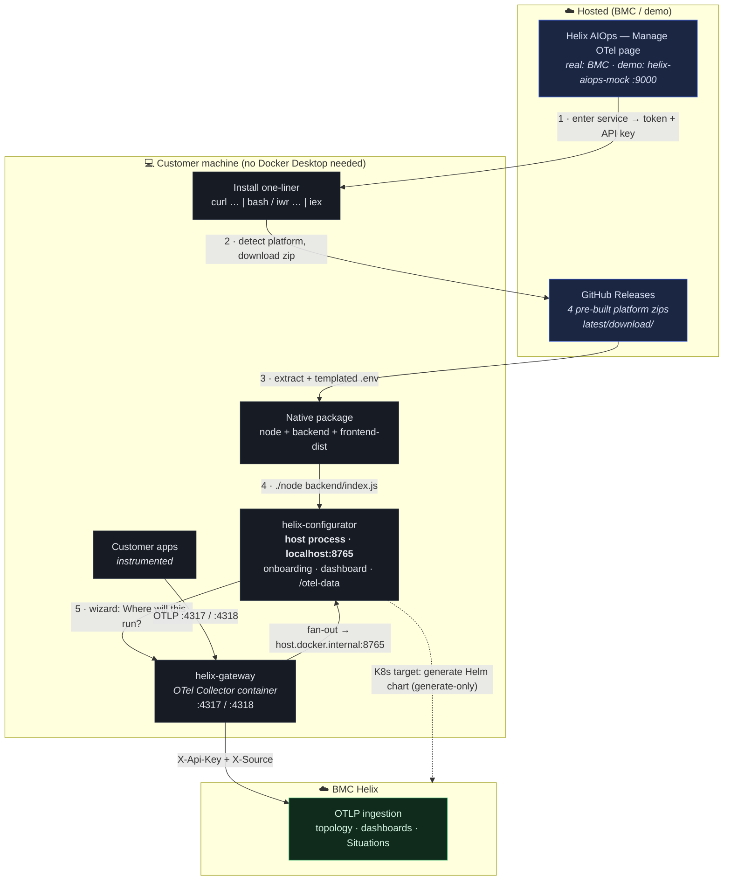
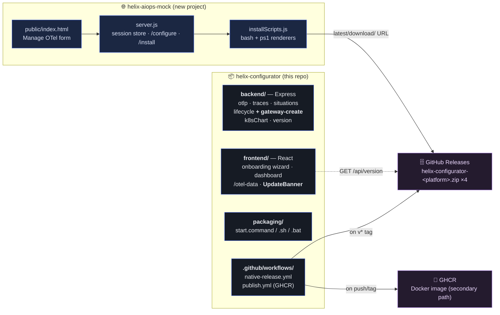

# Native Packaging — Architecture Diagrams

> Stakeholder-facing view of the native-packaging architecture. Companion to the
> [design spec](../superpowers/specs/2026-06-05-native-packaging-design.md) and
> [implementation plan](../superpowers/plans/2026-06-05-native-packaging.md).
> Rendered, theme-styled vector exports live alongside this file:
> [`native-packaging-e2e.svg`](native-packaging-e2e.svg) and
> [`native-packaging-codebase.svg`](native-packaging-codebase.svg) — crisp at any
> zoom and importable into PowerPoint / Keynote.

---

## 1. End-to-end flow

From the customer opening the Helix AIOps page to telemetry landing in BMC Helix —
**no Docker Desktop required to run the configurator.**

**Key shifts from the Docker-Compose model**

| | Before (Compose) | After (Native) |
|---|---|---|
| Run the configurator | Docker Desktop required | None |
| Configurator process | Container on `helix-bridge` | Host process on `:8765` |
| Gateway created by | `docker compose up` | **The configurator** (dockerode) |
| Local fan-out target | `helix-configurator:3001` | `host.docker.internal:8765` |
| Install payload | App source (build locally) | Pre-built zip (~80 MB) |

---

## 2. Codebase makeup

Two projects plus two artifact channels. The configurator is cleaned of all
demo/tunnel code; the demo page becomes its own project.

**Removed from the configurator:** `backend/routes/demo.js`,
`frontend/src/components/AiopsPage.tsx`, the `/aiops` route, `IS_DEMO_INSTALL`,
`computeInstallBaseUrl` + tunnel awareness, and the `marked` dependency.
**Kept:** `archiver` (still used by the K8s Helm-chart streamer).
